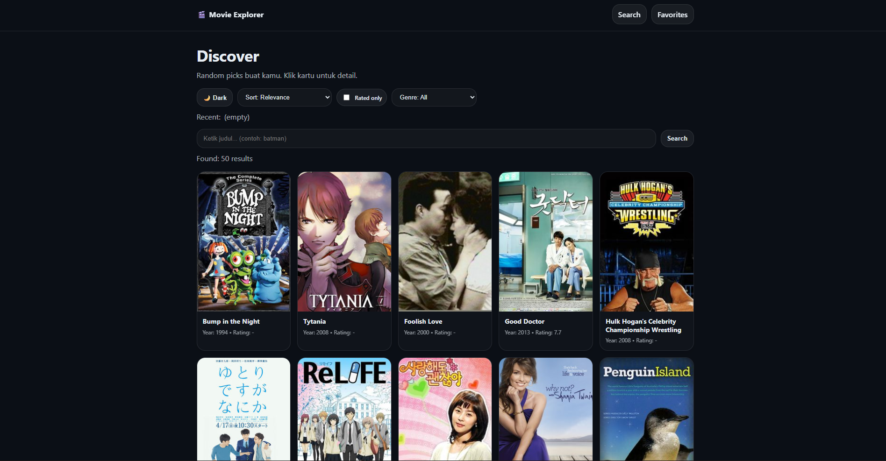
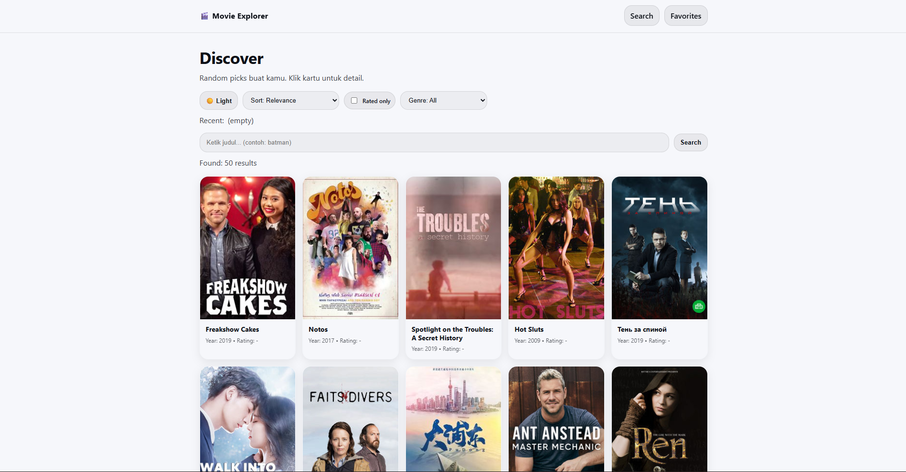

# 🎬 Movie Explorer

A modern movie discovery app built with Vanilla JavaScript.

## 🚀 Features
- 🔍 Search movies & TV shows (TVMaze API)
- 📄 Detail page
- ⭐ Add to Favorites (LocalStorage)
- 📑 Pagination
- 🎲 Discover random shows
- 🌙 Dark / Light Mode
- 🏷 Genre filter & rating sort
- ⚡ Debounce & AbortController

## 🛠 Tech Stack
- Vanilla JavaScript
- Fetch API
- LocalStorage
- Hash-based Routing
- CSS Variables (Dark/Light Theme)

## 📸 Screenshots

### Dark Mode

### Light Mode

## 🔗 Live Demo
👉 https://muhammadtamami.github.io/movie-explorer/
